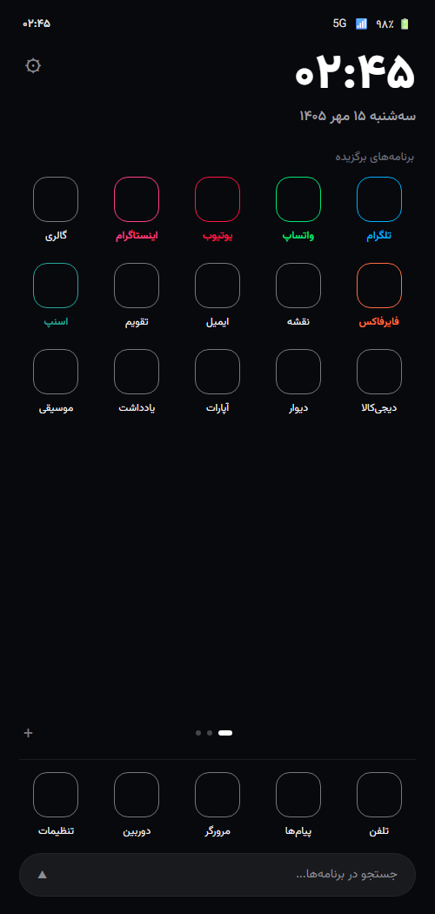
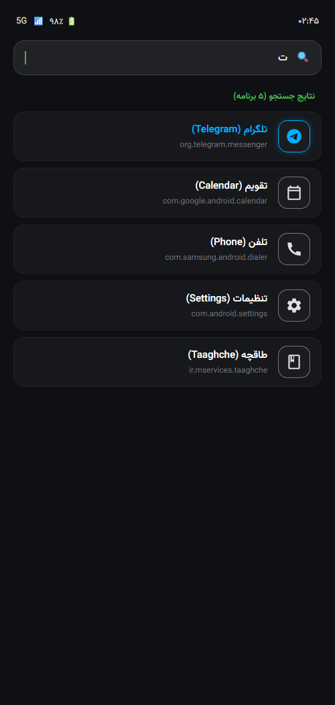
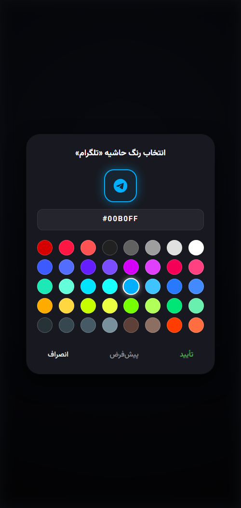

<p align="center">
  
</p>

<h1 align="center">ParLauncher • پر لانچر</h1>

<p align="center">
  <b>لانچر مینیمال، فوق‌سبک و دوست‌دار باتری برای اندروید</b><br>
  An ultra-lightweight, battery-friendly, and minimalist Android launcher built with pure Kotlin.
</p>

<p align="center">
  <a href="https://github.com/amooo-z/par-launcher/releases"></a>
  
  
  
  
  
  
</p>

---

## 📸 تصاویر برنامه | Screenshots

<p align="center">
  
  &nbsp;&nbsp;
  
  &nbsp;&nbsp;
  
</p>

<p align="center">
  <i>صفحه اصلی (پشتیبانی از تاریخ شمسی) • منوی جستجوی هوشمند • پالت شخصی‌سازی رنگ آیکون‌ها</i>
</p>

---

## ✨ ویژگی‌های برجسته (Features)

* **⚡ فوق‌سبک و بدون سربار (Ultra-Lightweight & Fast):**
  * حجم فایل نصبی نهایی (APK) تنها **~۴۳۷ کیلوبایت**!
  * مصرف حافظه رم (RAM) زیر **۱۵ مگابایت** در حالت اجرا.
  * رندرینگ سریع و روان با نرخ نوسازی ۶۰ تا ۱۲۰ هرتز بدون لگ یا تأخیر.

* **🔋 مصرف باتری صفر در پس‌زمینه (Zero Background Drain):**
  * فاقد هرگونه سرویس پس‌زمینه (Background Service) یا بیدارباش (WakeLock).
  * هماهنگی به‌روزرسانی ساعت و تقویم فقط در زمان روشن بودن صفحه و در ابتدای هر دقیقه.

* **🎨 پالت رنگ اختصاصی نئونی (Per-App Neon Palette):**
  * امکان تعیین رنگ حاشیه و افکت نئونی برای هر آیکون به دلخواه کاربر.
  * شامل پالت ۶۰ رنگ ماتریال و پشتیبانی از کدهای رنگی HEX.

* **📱 داک ۵ تایی به سبک Samsung One UI:**
  * نوار دسترسی سریع پایین صفحه با قابلیت درگ‌اند‌دراپ (Drag & Drop) روان.
  * جلوگیری خودکار از تکراری شدن برنامه‌ها بین داک و صفحات اصلی (Deduplication).

* **📄 صفحات چندگانه با چینش آبشاری (Multi-Page Grid):**
  * امکان ایجاد صفحات نامحدود با نشانگر نقطه‌ای (Dots Indicator).
  * قابلیت جابجایی هوشمند برنامه‌ها با پر شدن خانه‌ها و انتقال خودکار به صفحات بعدی.

* **🔍 جستجوی بلادرنگ با تصحیح هوشمند حروف فارسی:**
  * فیلتر آنی برنامه‌ها با تایپ نام فارسی یا انگلیسی.
  * نرمال‌سازی خودکار حروف عربی و فارسی (ی/ي، ک/ك) و نادیده‌گرفتن نیم‌فاصله‌ها در سرچ.

* **📅 تقویم شمسی بومی (Native Shamsi / Jalali Date):**
  * تبدیل و نمایش تاریخ شمسی با قلم زیبای وزیرمتن بدون نیاز به کتابخانه‌های خارجی سنگین.

* **🛡️ امنیت و حریم خصوصی ۱۰۰٪ آفلاین:**
  * برنامه حتی مجوز دسترسی به اینترنت (`INTERNET`) را ندارد! داده‌های شما هرگز از دستگاه خارج نمی‌شوند.

---

## 🛠️ ساختار فنی و معماری (Technical Architecture)

```
par-launcher/
├── app/src/main/
│   ├── java/com/parlauncher/
│   │   ├── MainActivity.kt        # مدیریت صفحات، دراور، رسیورها و تعاملات
│   │   ├── AppModel.kt            # مدل داده برنامه‌ها و نگاشت رنگ‌ها
│   │   ├── AppRepository.kt       # ایندکس بسته‌ها و استخراج آیکون‌های سیستمی
│   │   ├── LauncherAdapter.kt     # آداپتور گرید صفحات با ItemTouchHelper
│   │   ├── DockAdapter.kt         # آداپتور داک ۵ تایی پایین صفحه
│   │   ├── DrawerAdapter.kt       # آداپتور لیست جستجوی سریع
│   │   ├── ColorPickerDialog.kt   # دیالوگ انتخاب پالت رنگ نئونی
│   │   └── JalaliCalendar.kt      # الگوریتم سبک و نیتیو گاه‌شماری جلالی
│   └── res/
│       ├── font/vazirmatn.ttf     # تایپوگرافی زیبای وزیرمتن
│       ├── layout/                # لایه‌های XML بهینه‌سازی‌شده
│       └── values/                # استایل‌های تاریک AMOLED
```

* **زبان:** Kotlin 100%
* **حداقل نسخه اندروید:** Android 8.0 (API 26) به بالا
* **کتابخانه‌های فرعی:** **۰ (صفر)** – بدون هیچ ابزار تحلیلی، کرش‌ریپورت، تبلیغات یا کتابخانه سنگین سوم‌شخص.

---

## 📥 نصب و دریافت (Installation)

### ۱. نصب مستقیم فایل APK:
آخرین فایل نصبی امضاشده را مستقیماً از بخش [Releases](https://github.com/amooo-z/par-launcher/releases) دانلود کرده و روی گوشی خود نصب کنید:
* **[دانلود مستقیم ParLauncher-v1.0.0.apk](https://github.com/amooo-z/par-launcher/releases/download/v1.0.0/ParLauncher-v1.0.0.apk)** (~۴۳۷ کیلوبایت)

### ۲. ساخت از روی سورس کد (Build from Source):
پیش‌نیازها: JDK 17 و Android SDK.

```bash
# کلون کردن ریپازیتوری
git clone https://github.com/amooo-z/par-launcher.git
cd par-launcher

# کامپایل و ساخت نسخه نهایی
./gradlew assembleRelease
```
فایل APK تولیدشده در مسیر زیر قرار خواهد گرفت:
`app/build/outputs/apk/release/app-release.apk`

---

## 📄 مجوز (License)

این پروژه تحت مجوز [MIT](LICENSE) منتشر شده است و برای استفاده شخصی یا تجاری آزاد می‌باشد.
